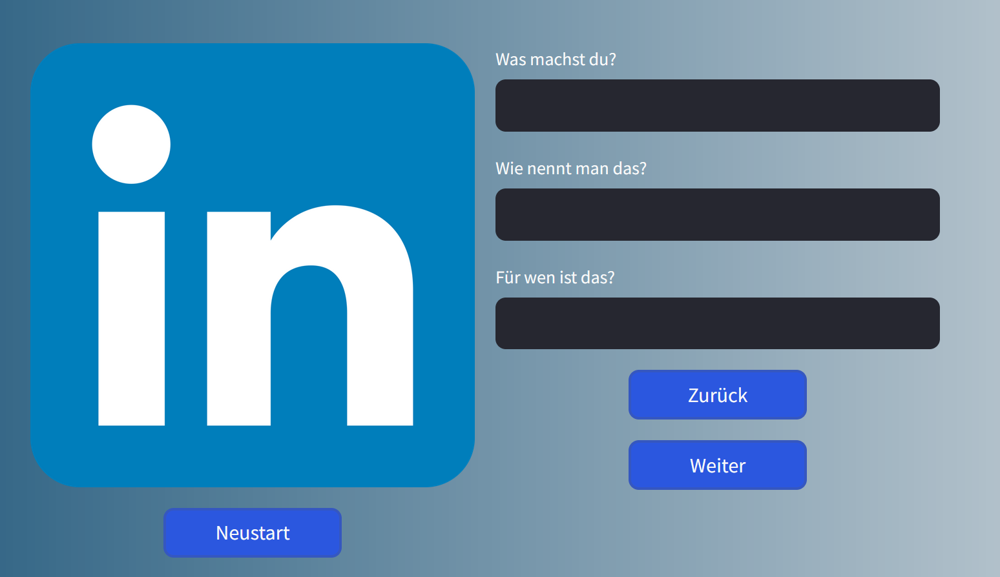

# linkedin-poster
A user-friendly Streamlit frontend tied to a fine-tuned LLM using the OpenAI API to generate creative LinkedIn Posts based on provided data like pre-defined writing styles.




### How to run
Follow these instructions to use the LinkedIn Poser:
```
pip install -r requirements.txt
```
to install the required modules and versions. Then,
```
streamlit run app.py
```

You need to provide a `.env` file with an OpenAI API Key. Otherwise, the last step (the post generation) will fail.